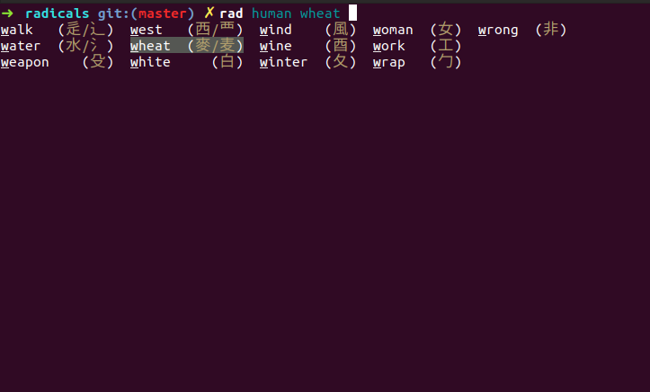

# radicals

`radicals.py` is script to quickly search for japanese kanji characters using its radicals/parts. 

## Usage

List available radicals and their description
```bash
$ python3 radicals.py 
一  one
丨  line
丶  dot
丿  slash
乙  second
亅  hook
二  two
亠  lid
人  man, human
儿  legs
...
龜  turtle, tortoise
龠  flute

```

Search for kanji using radical/part descriptions
```bash
$ python3 radicals.py lid human silk
綷  lid, man, human, ten, complete, small, insignificant, short, tiny, silk
纉  shell, eye, silk, short, tiny, small, insignificant, man, human, big, very, two, lid
```

List kanji radicals/parts
```bash
$ python3 radicals.py 知
口  mouth, opening
矢  arrow
```

## Installation

Just clone the repository and download the kanji and radical data with
```bash
$ make download
```

## Fish shell completion

If you copy the included `radicals.fish` file in the correspoding folder for fish shell completions `~/.config/fish/completions/`, you can use the handy autocompletion/autosuggestions features with `radicals.py`.

(Note that the fish completion file assumes that there's a program called `rad` in your `$PATH`. To make this work be sure to rename `radicals.py` to `rad` or change the fish completion file accordingly. Also `radicals.fish` should be named according to the program in your path, i.e. `rad.fish`).


